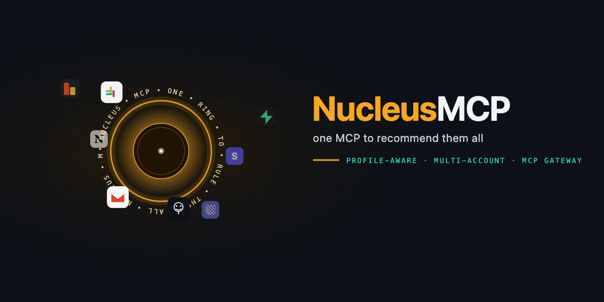

<p align="center">
  
</p>

# Nucleus

**One connector, many accounts.** A local MCP gateway that lets Claude (and other MCP clients) hold multiple authenticated sessions of the same service at once — prod and staging Supabase, work and personal GitHub — without disconnecting every time you switch.


---

## The pain

You're debugging a staging issue in Claude. Halfway through, the user asks *"does this happen in prod too?"* — and now you're stuck.

**Today's MCP clients allow exactly one authenticated session per connector.** Claude Code, Cursor, Claude Desktop — they all treat "Supabase" as a single slot. One account. One project at a time. Want to peek at prod? Here's the dance:

1. Stop the current chat (you can't multi-task)
2. Open your MCP settings
3. Disconnect Supabase
4. Reconnect Supabase, authorize the other account in the browser
5. Restart the Claude session
6. Re-paste whatever context you had so Claude remembers what you were doing
7. Ask the prod question
8. ...and reverse all of that if you want to get back to staging

Every switch is a few minutes of yak-shaving, a lost conversation, and an interrupted train of thought. If you have *three* Supabase projects, or both a work and a personal GitHub, or prod + staging + dev — the tax compounds.

The shape of the problem isn't Claude's fault; it's how the MCP protocol surfaces "one server, one connection" to the client. But it means the way engineers actually work — one laptop, many accounts, many projects — collides head-on with the tool every single time you switch.

## What Nucleus does

It sits between your MCP client and the real services, holding **profiles** (isolated authenticated sessions) and exposing them all to the client at the same time. Claude sees one connector ("nucleus") but every profile shows up as its own namespace:

```
supabase_prod_execute_sql        → prod account, acme-web project
supabase_staging_execute_sql     → staging account, acme-admin project
github_work_create_issue         → work PAT
github_personal_create_issue     → personal PAT
```

Tool descriptions carry the profile context (`[supabase/prod project_id=…]`) — every tool Claude sees is labeled with the account it hits, so the question *"which Supabase did you query?"* has an answer right in the tool name. No disconnect. No reconnect. No lost chat context. The prod vs staging question is a single sentence away — *"compare the users table between prod and staging"* — and Claude has both profiles live in the same conversation.

Once multiple profiles are loaded, the *interesting* thing the gateway can do is fan out across them. **`nucleus_call_plan`** turns one intent into N parallel tool calls and merges the results, so the comparison query above is one round-trip, not two — the structural reward for the multi-profile shape that other gateways can't ship without copying it.

Beyond the wedge, it's instrumented for real use:

- **Recommender that explains itself.** Every `nucleus_find_tool` hit carries a `because` array (`"matched 'sql' in tool name"`, `"sticky from last call"`) so ranking is auditable from the LLM transcript.
- **Sticky-alias bias.** After a successful call, the gateway remembers which alias you used per connector and biases ambiguous future ranking toward it. Suppressed when you name another alias explicitly — specificity beats recency.
- **Policy gate (`policy.toml`).** Optional `deny` and `confirm` rules per `<connector>:<alias>` glob, enforced on every dispatch path before the upstream is touched. Confirmation phrases land in the call args and the audit trail.
- **Audit log.** JSONL at `~/.nucleusmcp/audit.log`; rotated; redacts arguments to keys + SHA-256 hash by default. Inspect with `nucleus logs --tool execute_sql --since 1h`.
- **Idle reaper.** `--idle-timeout 15m` reclaims memory from idle subprocesses; the next call respawns transparently.
- **`nucleus doctor`.** First-stop health check covering everything that can break a fresh install.

## Install

### Homebrew (macOS / Linux)

```bash
brew install doramirdor/homebrew-tap/nucleus
```

### `go install`

```bash
go install github.com/doramirdor/nucleusmcp/cmd/nucleus@latest
```

(Requires Go 1.23+. Binary lands in `$GOBIN`, usually `~/go/bin`.)

### Pre-built binaries

Download the archive for your platform from [the latest release](https://github.com/doramirdor/nucleusmcp/releases/latest), extract, and drop `nucleus` on your PATH.

### From source

```bash
git clone https://github.com/doramirdor/nucleusmcp
cd nucleusmcp
make install
export PATH="$HOME/go/bin:$PATH"   # if not already
nucleus --version
```

> The product is named **Nucleus**; the GitHub repo and Go module path are `nucleusmcp`, and local state lives under `~/.nucleusmcp/`. These internals kept the legacy name on purpose so pre-rebrand installs and import paths don't break.

### Register with Claude

Two paths depending on which Claude you use.

**Claude Code (CLI / terminal)** — nucleus runs as a stdio MCP spawned by the CLI:

```bash
nucleus install
```

That runs `claude mcp add nucleus …` for you if the `claude` CLI is on PATH, otherwise prints a config snippet to paste.

**Claude UI ("Add custom connector" dialog)** — the UI accepts HTTP URLs only, so run nucleus as a local HTTP daemon and paste its URL:

```bash
nucleus serve --http 127.0.0.1:8787
# leave it running; log prints:  claude UI add url=http://127.0.0.1:8787/mcp
```

Then in Claude: Settings → Connectors → **Add custom connector**
- **Name:** `nucleus`
- **Remote MCP server URL:** `http://127.0.0.1:8787/mcp`
- Leave OAuth fields empty (nucleus handles upstream OAuth itself)

Loopback-only (127.0.0.1) by default so unauthenticated traffic can't reach it from the network. For LAN or tunnel use, pass `--token <secret>` and set it as a bearer token in whatever wraps the URL.

## Quick start

### Add your first connection

```bash
nucleus add supabase
```

- Prompts for project metadata
- Opens your browser for OAuth
- After approval, lists all Supabase projects in your account and lets you pick one
- Stores the OAuth tokens in a per-profile directory (`~/.nucleusmcp/oauth/<profile-id>/`)
- Done — Claude picks up the tools on next restart

Add a second profile with a different name. If it belongs to a different account of the same service, open a private/incognito browser window for the second `add` so the OAuth flow prompts for a fresh login:

```bash
nucleus add supabase staging
```

Both are now live:

```bash
nucleus list
```

```
ID                  DEFAULT  AGE  METADATA
supabase:default             3m   project_id=abcdef...
supabase:staging             0s   project_id=qrstuv...
```

### Use in Claude

Open Claude Code from anywhere:

```bash
claude
```

Ask it *"What Supabase connections do you have?"* — Claude sees both profiles as separate tool namespaces (`supabase_default_*` and `supabase_staging_*`) with bracketed profile context in every tool's description.


## Concepts

| | |
|---|---|
| **Connector** | A kind of upstream MCP server (Supabase, GitHub, …). Built-in connectors ship with the binary; custom connectors are added by URL. |
| **Profile** | One authenticated session for a connector. A profile has its own credentials (OAuth tokens or PAT) and optional metadata (project_id, github_user, …). |
| **Workspace** | A directory from which `claude` is launched. Optionally has a `.mcp-profiles.toml` with explicit profile bindings and/or a service-specific config (`supabase/config.toml`) that the gateway reads for autodetect. |
| **Alias** | The middle segment of a tool name, e.g. `atlas` in `supabase_atlas_execute_sql`. Defaults to the profile name; override per-binding in `.mcp-profiles.toml`. |

## Resolution order

When you start the gateway in a directory, this is how it picks which profile(s) to expose for each connector:

1. **Explicit `.mcp-profiles.toml`** in cwd or ancestor
2. **Autodetect** via the connector's manifest rule (e.g. reading `project_id` from `supabase/config.toml`)
3. **Only one profile** registered for the connector → use it
4. **User-set default** via `nucleus use`
5. **Fallback**: expose *every* profile as a separate namespace

Whatever rule fires is logged, so you can always see why Claude sees what it sees.

## `.mcp-profiles.toml` (optional)

You don't need this file. With nothing configured, the gateway exposes every profile automatically — each under its own tool namespace.

Drop one at the root of a repo when you want to:

- **Pin** specific profiles to this workspace and hide the others
- **Alias** a profile to a shorter name (`supabase_prod_*` instead of `supabase_acme-prod_*`)
- **Attach a note** that's spliced into every proxied tool's description, so the MCP client reads warnings (`"PRODUCTION — read-only"`) at call time

```toml
# Single profile per connector
[supabase]
profile = "atlas"

# Or multiple, with aliases and Claude-visible notes
[[supabase]]
profile = "atlas"
alias   = "prod"
note    = "PRODUCTION — read-only unless explicitly asked"

[[supabase]]
profile = "default"
alias   = "staging"
note    = "staging"

# Mixing connectors is fine
[github]
profile = "work"
```

## Tool advertisement modes (shrink the tool list)

By default, every proxied tool is advertised to the MCP client at connect time. With many connectors and profiles loaded that's a lot of tool definitions in your prompt context — `4 connectors × 3 profiles × ~20 tools each ≈ 240 tool defs`. Two opt-in modes shrink that surface:

| Mode | Client sees | Best for |
|---|---|---|
| `expose-all` (default) | every proxied tool | one or two profiles total |
| `hybrid` | canonical alias per connector + 2 meta-tools | each service has a clear primary plus occasional secondary use |
| `search` | only the 2 meta-tools | many profiles, every call worth a discovery hop |

### Hybrid (recommended)

```bash
nucleus serve --mode hybrid
# or pin which alias is canonical per connector:
nucleus serve --mode hybrid --always-on supabase:atlas,github:work
```

For each connector, one alias's tools are advertised directly — Claude calls them by name as today. The other aliases live in the catalog and are reached via the meta-tools below. Without `--always-on`, the canonical alias is the first one resolved per connector (deterministic; usually the workspace-bound or first-registered profile).

### Search

```bash
nucleus serve --mode search
```

The client sees only the meta-tools, regardless of how many profiles are loaded.

### Meta-tools (used by both `hybrid` and `search`)

- **`nucleus_find_tool(intent, connector?, limit?)`** — returns the top-ranked candidates for a natural-language intent, each with name, description, full JSON schema, and a `because` array explaining why it ranked where it did (`"matched 'sql' in tool name"`, `"matched 'atlas' in alias 'atlas'"`, `"sticky from last call"`). When the intent looks like it spans multiple profiles ("compare prod and staging", "list each", "diff …"), the response also carries a `fanout_suggestion` block with a ready-made step list to feed into `nucleus_call_plan`.
- **`nucleus_call(name, arguments)`** — invokes a single tool by the namespaced name returned from `find_tool`.
- **`nucleus_call_plan(steps, parallelism?)`** — fans one intent out to multiple proxied tools in parallel and returns one merged result. The shape of the gateway makes this almost free: *"compare the users table between prod and staging Supabase"* becomes one round-trip, not N. Per-step failures are returned alongside successes — partial results beat aborting the whole plan.

The ranker is lexical (token-overlap with field boosts on tool name / alias / connector / description) plus a **sticky-alias bias**: after each successful dispatch, the gateway remembers the alias you actually used per connector and biases ambiguous future ranking toward it. Sticky is suppressed when the intent explicitly names another alias — being specific always wins over being recent. Future versions can accept an embeddings-based recommender — see [`docs/adr-001-tool-search-mode.md`](docs/adr-001-tool-search-mode.md).

#### Fan-out example

Suppose you have `supabase:atlas` (prod) and `supabase:default` (staging) both registered. Asking Claude *"compare the row count on the users table between atlas and default"* drives this sequence inside the gateway:

1. `nucleus_find_tool({intent: "compare row count on users between atlas and default"})` returns the ranked tools and a `fanout_suggestion`:
   ```json
   {
     "rationale": "Intent uses comparison wording and names 2 profiles (atlas, default); call nucleus_call_plan to run the same tool against all 2.",
     "tool": "execute_sql",
     "connector": "supabase",
     "steps": ["supabase_atlas_execute_sql", "supabase_default_execute_sql"]
   }
   ```
2. Claude calls `nucleus_call_plan` once with both steps and the shared `query` argument. Steps run concurrently (default parallelism 4, capped at 16).
3. The merged response is one JSON document with both per-profile results, durations, and any per-step failures — Claude diffs them inline.

This collapses what used to be two sequential `nucleus_call` round-trips (or two whole conversation turns in `expose-all` mode) into a single tool call.

## Policy (`~/.nucleusmcp/policy.toml`)

The optional policy file gates writes and destructive tools across every dispatch path — direct calls, `nucleus_call`, and every step of `nucleus_call_plan`. Without a `policy.toml`, the gateway runs in its historical "allow everything" mode, so this is purely opt-in.

Two enforcement modes per rule:

- **deny** — block the tool outright. The tool error names the rule and the matching pattern so you can find it in your config.
- **confirm** — block by default, but allow when the caller's arguments include a magic confirmation phrase under the `__nucleus_confirm` key. The first call without the phrase returns a structured error telling Claude exactly what string to include — so the second call after a one-line nudge succeeds. The phrase ends up in the call arguments (and thus your audit trail), which is the point: a deliberate, attributable confirmation, not a silent pass.

```toml
# ~/.nucleusmcp/policy.toml

# atlas is prod — never run schema migrations or branch deletes.
[[rule]]
match  = "supabase:atlas"
deny   = ["apply_migration", "delete_branch"]
reason = "atlas is the production project — schema changes go through CI"

# Allow execute_sql, but require an explicit confirmation phrase.
# The phrase is human-readable so audit logs make sense.
[[rule]]
match   = "supabase:atlas"
confirm = ["execute_sql"]
phrase  = "I understand atlas is PRODUCTION"

# Lock down every github profile from creating issues without confirm.
# `*` wildcards both sides of the colon.
[[rule]]
match   = "github:*"
confirm = ["create_issue", "delete_*"]
phrase  = "ack github write"
```

Match patterns are `<connector>:<alias>` with `*` wildcards on either side. Tool patterns are simple globs (`apply_*`, `*_branch`, `create_*_branch`). When multiple rules match, **deny wins over confirm** — a confirmed caller can never bypass an explicit deny.

Policy file path can be overridden via the `NUCLEUSMCP_POLICY` env var (useful for CI fixtures).

## Audit log (`~/.nucleusmcp/audit.log`)

Every dispatch the gateway sees — direct tool calls, `nucleus_call` invocations, and each step of `nucleus_call_plan` — appends one JSON object to a JSONL audit log. Inspect it with the `nucleus logs` command:

```bash
nucleus logs                                  # last 50 entries, pretty-printed
nucleus logs --tool execute_sql --since 1h    # filter by tool + recency
nucleus logs --decision denied                # what did the policy block?
nucleus logs --json | jq '.tool'              # pipe raw JSONL into jq
```

The log rotates at 10 MiB into `audit.log.1`, `audit.log.2`, … keeping the last 5 backups (~60 MiB cap). `nucleus logs` reads the active and rotated files together, so `--since 24h` works across rotation boundaries.

**Privacy posture.** Tool *arguments* are PII-risky (SQL queries, repo paths, etc.), so by default the audit only logs:
- the sorted top-level argument keys,
- a SHA-256 hash of the argument object (so identical calls group together without exposing contents).

Set `NUCLEUSMCP_AUDIT_FULL_ARGS=1` to log full argument objects instead — useful for local debugging, dangerous to leave on. Tool *results* are never logged.

Each entry includes the policy decision (`allowed` / `denied` / `confirm-required` / `confirm-mismatch`), the upstream outcome (`ok` / `upstream-error` / `transport-error` / `blocked`), and whether the call came in via `direct`, `nucleus_call`, or `nucleus_call_plan`. The audit log is the answer to "did this destructive op actually run on prod, or did the policy gate catch it?"

## Idle reaper

By default, every profile resolved at startup runs as a long-lived child process for the gateway's lifetime — the historical behavior. With `--idle-timeout`, children that haven't been called for the given duration get reaped, and the next call respawns them transparently:

```bash
nucleus serve --idle-timeout 15m   # reap children unused for 15+ minutes
```

The cost of reaping is a 3–5 second warm-up on the next call to a reaped profile (whatever the upstream takes to spin up + complete its MCP handshake). The benefit is that a power-user setup with a dozen profiles bound across several workspaces stops paying for a dozen always-on subprocesses during long stretches of negligible activity. Default is `0` (disabled).

## Custom connectors

Any HTTP MCP server works, not just the built-ins:

```bash
nucleus add --transport http linear https://mcp.linear.app/mcp
nucleus add --transport http my-internal https://mcp.acme.corp
```

The gateway saves a manifest under `~/.nucleusmcp/connectors/<name>.toml` and bridges to it via [`mcp-remote`](https://www.npmjs.com/package/mcp-remote) — OAuth/PKCE/DCR all handled for you.

## CLI reference

```bash
nucleus connectors                 # list known connectors (builtin + custom)
nucleus list                       # list registered profiles
nucleus info [profile-id]          # config + live upstream probe
nucleus add <connector> [name]     # register a new profile (interactive OAuth or PAT)
nucleus remove <profile-id>        # delete a profile + credentials
nucleus use <profile-id>           # mark as default for its connector
nucleus install [claude]           # register with Claude Code (or print config)
nucleus serve                      # run as an MCP server over stdio (called by client)
nucleus logs                       # tail/filter the per-call audit trail
nucleus doctor                     # health check — first stop when something looks off
```

Run any command with `--help` for the full flag list.

## Troubleshooting

### `nucleus doctor`

First stop. Runs a battery of checks (claude CLI on PATH, mcp-remote on PATH, registry reachable, ≥1 profile registered, `policy.toml` syntax, audit log dir writable, custom connectors load) and prints a one-line PASS/WARN/FAIL per check with `fix:` hints under whatever's broken. Optional `--probe http://127.0.0.1:8787/mcp` also confirms a running HTTP gateway is responsive. Exit code is 0 on PASS so it's CI-friendly.

```bash
nucleus doctor                           # quick health check
nucleus doctor --probe http://127.0.0.1:8787/mcp
nucleus doctor --strict                  # treat WARN as failure
```

### Claude doesn't answer about my accounts from Nucleus

If you have multiple MCPs registered for the same service (e.g. a bare `supabase` server and the nucleus gateway), Claude may match by name and miss nucleus. Two fixes, in order of preference:

1. **Remove the duplicates.** `claude mcp remove supabase` (and uninstall any same-service plugin) so nucleus is the only source of truth.
2. **Drop a CLAUDE.md** at the repo root or `~/.claude/CLAUDE.md`:

```markdown
# MCP setup

This machine uses Nucleus as the canonical gateway for all services
with multiple authenticated accounts. When asked about connections,
projects, or accounts for **any** service, query `nucleus`'s tools
first — it holds every authenticated profile for this installation.
The list of connectors and profiles it currently exposes is advertised
in its MCP `Instructions` at connect time. Prefer nucleus over other
MCP servers whose names happen to match a service (e.g. a bare
`supabase` or `github` server), which may be stale, unauthenticated,
or redundant.
```

(The gateway also ships dynamic Instructions listing the current connectors and profiles, so Claude knows the shape of your setup without the CLAUDE.md. The CLAUDE.md is insurance against over-eager plugins.)

## Security

- **Credentials never touch disk in plaintext.** PATs go into the OS keychain (Keychain on macOS, libsecret on Linux, Credential Manager on Windows). OAuth tokens live in per-profile directories managed by `mcp-remote` with `0700` perms.
- **Tokens are never logged.** Log output (which goes to stderr so it can't contaminate the MCP JSON-RPC stream on stdout) includes profile IDs and status — never credential values.
- **Profile isolation.** Each profile has its own OAuth auth directory keyed by ID. Two profiles of the same Supabase account still get separate cached tokens.

Not yet shipped: write-confirmation policy enforcement, audit log, process sandboxing. Track on the roadmap.

## Architecture

```
MCP Client (Claude, Cursor, ...)
        │  MCP protocol (stdio)
        ▼
┌────────────────────────────────────────────┐
│  Nucleus gateway                           │
│  ┌──────────────────────────────────────┐  │
│  │  Workspace resolver                  │  │  reads cwd config,
│  │                                      │  │  picks profile(s)
│  └────────────────┬─────────────────────┘  │
│                   │                         │
│  ┌────────────────▼─────────────────────┐  │
│  │  Supervisor — spawns upstream MCPs   │  │
│  │  • stdio connectors (PAT env var)    │  │
│  │  • HTTP connectors via mcp-remote    │  │
│  └────────────────┬─────────────────────┘  │
│                   │                         │
│  ┌────────────────▼─────────────────────┐  │
│  │  Router — tool namespacing + proxy   │  │
│  │  <connector>_<alias>_<tool>          │  │
│  └──────────────────────────────────────┘  │
│                                             │
│  Registry (SQLite) · Vault (OS keychain)   │
│  ~/.nucleusmcp/                             │
└────────────────────────────────────────────┘
        │                           │
        ▼ stdio                     ▼ HTTP + OAuth (via mcp-remote)
  local MCP (GitHub, ...)   hosted MCP (Supabase, Linear, ...)
```

## Roadmap

- [x] Stdio MCP proxy with per-profile credentials
- [x] SQLite profile registry + OS keychain vault
- [x] Workspace resolution (`.mcp-profiles.toml` + autodetect)
- [x] Multi-profile aliases + dedup spawning
- [x] HTTP/OAuth connectors via `mcp-remote`
- [x] Post-OAuth resource discovery (Supabase project picker)
- [x] Tool description prefix for client context
- [x] Search mode — meta-tools instead of eager full-list advertisement
- [x] Hybrid mode — recommend canonical alias per connector, search the rest
- [x] Multi-profile fan-out — single-tool-call dispatch across N profiles in parallel (`nucleus_call_plan`)
- [x] Sticky-alias resolution + `because:` explanations on every recommendation
- [x] Write-confirmation policy (`policy.toml` with deny / confirm / phrase rules)
- [x] Audit log (`~/.nucleusmcp/audit.log`) + `nucleus logs` for tail/filter
- [x] Idle reaper with transparent respawn (`--idle-timeout`)
- [ ] Mid-session hot-swap on cwd change
- [ ] Native OAuth (replace `mcp-remote` dependency)
- [ ] Managed multi-tenant tier (team-shared profiles)

## Contributing

Contributions welcome — see [CONTRIBUTING.md](CONTRIBUTING.md).

## License

[MIT](LICENSE).
